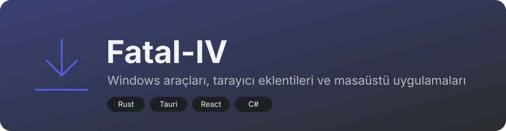
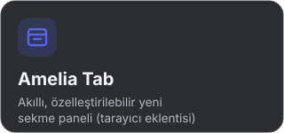

  

  Küçük, hızlı ve sade masaüstü araçları geliştiriyorum. Çoğu Windows için, hepsi kendi ihtiyacımdan doğdu.

## Projeler

<table>
  <tr>
    <td></td>
    <td></td>
  </tr>
  <tr>
    <td></td>
    <td></td>
  </tr>
</table>

## Araçlar

